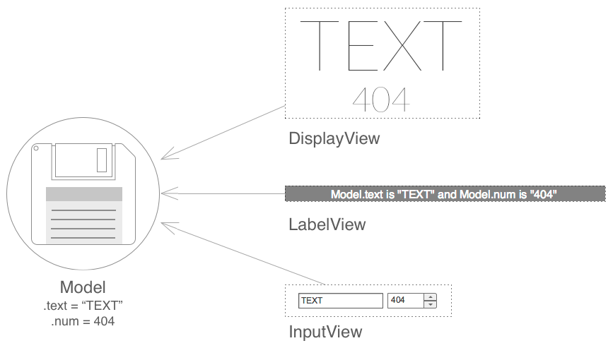

<embed src="/files/showcase/reflow.sample.dependency-inection.simple-singleton-model/index.swf" width="500" height="300" class="center border"/>


Example
===================================

`View`에 `Model`을 주입시키는 간단한 예제



현재 예제 상에서의 구조는 위와 같다.

- 데이터를 출력하는 `DisplayView`
- 데이터를 문장 형태로 출력하는 `LabelView`
- 그리고, 데이터를 편집할 수 있는 `InputView`
- 이 3개의 `View`들이 `Model`에 의존하고 있다.


Source Code (_<https://github.com/iamssen/reflow.sample.dependency-inection.simple-singleton-model>_)
===================================================

### `Model`

```as3
package reflow.sample.models {

public class Model {
    [Bindable]
    public var text:String="TEXT";

    [Bindable]
    public var num:int=404;
}
}
```

Application의 뼈대가 되는 `Model`.

Data Binding 작동을 해야 하므로 `[Bindable]`이 걸려 있다.

### `View`

```mxml
<!-- reflow.sample.views.DisplayView -->
<?xml version="1.0" encoding="utf-8"?>
<s:Group xmlns:fx="http://ns.adobe.com/mxml/2009" xmlns:s="library://ns.adobe.com/flex/spark" xmlns:mx="library://ns.adobe.com/flex/mx">
    <fx:Script>
        <![CDATA[
            import reflow.sample.models.Model;

            [Inject]
            [Bindable]
            public var model:Model;
        ]]>
    </fx:Script>

    <s:layout>
        <s:VerticalLayout paddingTop="0" paddingBottom="0" paddingLeft="0" paddingRight="0" gap="0" horizontalAlign="center" verticalAlign="top"/>
    </s:layout>

    <s:Label text="{model.text}" fontFamily="Lato" fontSize="100"/>
    <s:Label text="{model.num}" fontFamily="Lato" fontSize="48"/>
</s:Group>
```

중요한 부분은 `[Inject]` 이다.

[Reflow Framework]는 `[Inject]` Metadata Tag를 사용해서 Dependency Injection 기능을 구현한다. (_뭐 `model = FlexGlobal.topLevelApplication.model` 이딴 코드가 필요 없다._)

```mxml
<!-- reflow.sample.views.LableView -->
<?xml version="1.0" encoding="utf-8"?>
<s:Group xmlns:fx="http://ns.adobe.com/mxml/2009" xmlns:s="library://ns.adobe.com/flex/spark" xmlns:mx="library://ns.adobe.com/flex/mx">
    <fx:Script>
        <![CDATA[
            import reflow.sample.models.Model;

            [Inject]
            [Bindable]
            public var model:Model;
        ]]>
    </fx:Script>

    <s:Rect width="100%" height="100%">
        <s:fill>
            <s:SolidColor color="#818181"/>
        </s:fill>
    </s:Rect>

    <s:Label text='Model.text is "{model.text}" and Model.num is "{model.num}"' horizontalCenter="0" verticalCenter="1"
             fontFamily="Helvetica Light, Helvetica, NanumGothic Light, NanumGothic, _sans" fontWeight="normal" fontSize="16" color="#ffffff"/>
</s:Group>
```

역시 `[Inject]`를 사용해서 `Model`을 가져오고 있다.

```mxml
<!-- reflow.sample.views.InputView -->
<?xml version="1.0" encoding="utf-8"?>
<s:HGroup xmlns:fx="http://ns.adobe.com/mxml/2009" xmlns:s="library://ns.adobe.com/flex/spark" xmlns:mx="library://ns.adobe.com/flex/mx">
    <fx:Script>
        <![CDATA[
            import reflow.sample.models.Model;

            [Inject]
            [Bindable]
            public var model:Model;
        ]]>
    </fx:Script>

    <s:TextInput text="@{model.text}" width="120"/>
    <s:NumericStepper value="@{model.num}" minimum="-1000" maximum="1000" width="70"/>
</s:HGroup>
```

역시 `[Inject]`를 사용하고 있다. 양방향(_수정 가능한_) Data Binding을 사용하기 위해서 `@{}`를 사용하고 있다.


### `Context`

위에 `Model`과 `View`는 `MV*` 구성 코드들이다. `MV*` 형태로 분리되어 작성되어 있는 코드들이다.

어쨌든 **분리되어 작성된** 코드들 이라면, 이를 **다시 결합 시켜줄** 코드 역시 필요하다. (_보통 `MV*` Framework들은 `Model`, `View`와 같은 Application 구성 코드들에서는 별 차이가 없다. 이를 다시 결합시켜주는 방식에서 차이가 나게 된다._)

[Reflow Framework]는 `Context`를 사용해서 결합을 하게 된다.

```as3
package reflow.sample {
import reflow.sample.models.Model;
import reflow.sample.views.DisplayView;
import reflow.sample.views.InputView;
import reflow.sample.views.LabelView;

import ssen.reflow.context.Context;

public class AppContext extends Context {

    override protected function mapDependency():void {
        injector.mapSingleton(Model);

        viewMap.map(DisplayView);
        viewMap.map(LabelView);
        viewMap.map(InputView);
    }

}
}
```

`Context`는 만들어진 코드들이 어떻게 작동되어야 하는지 역할을 지정해준다.

- `injector.mapSingleton(Model)` Model이 Singleton으로 작동되게 된다. (_Model 이니깐 어쨌든 Context 내에서 유일하게 작동되어야 한다._)
- `viewMap.map(DisplayView)` View를 선언해준다. (_선언 안해주면 그냥 화면에 표시될 뿐 Application의 구성원으로 작동하지는 않는다._)


### `App`

이제 `Model`과 `View`라는 Application의 구성원들도 만들었고, 그것들이 어떻게 결합될지 역할을 지정해주는 `Context`도 만들었다.

다 만들었으니 이제 실제 Application에 적용을 해야한다.

```mxml
<!-- reflow.sample.App -->
<?xml version="1.0" encoding="utf-8"?>
<s:Group xmlns:fx="http://ns.adobe.com/mxml/2009" xmlns:s="library://ns.adobe.com/flex/spark" xmlns:mx="library://ns.adobe.com/flex/mx" xmlns:views="reflow.sample.views.*"
         xmlns:sample="reflow.sample.*" clipAndEnableScrolling="true">

    <fx:Declarations>
        <sample:AppContext/>
    </fx:Declarations>

    <views:DisplayView top="30" width="100%" horizontalCenter="0"/>
    <views:LabelView top="193" width="100%" height="34" horizontalCenter="0"/>
    <views:InputView top="250" horizontalCenter="0"/>
</s:Group>
```

- `<sample:AppContext/>`와 같이 MXML 형태로 `Context`를 넣어주고,
- `<views:DisplayView/>`, `<views:LabelView/>`, `<views:InputView/>` 형태로 `View`들을 넣어준다.

위에서 작성한 `App`을 화면에 등장시키면 작동이 된다.


[Reflow Framework]: https://github.com/iamssen/reflow