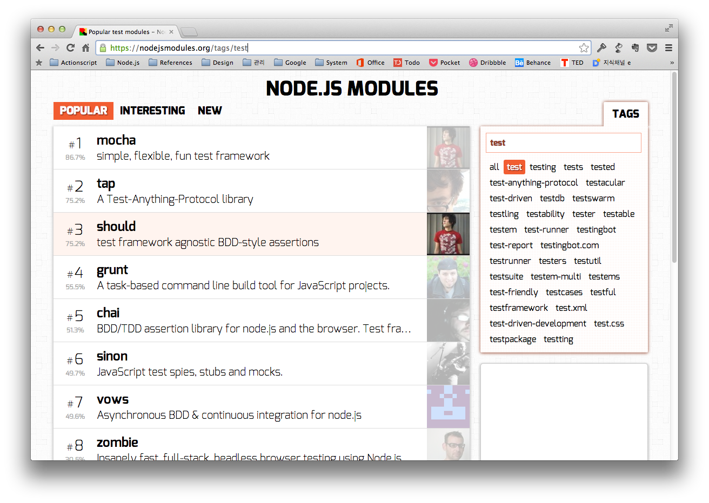

# NPM : Node Package Manager

Node.js의 package들을 관리해준다. 사실 `npm` 모르면서 Node.js를 개발하는 사람은 없을 것이기 때문에 사족을 붙일 필요는 없다.

# 모듈 랭킹 알아보기 : <https://nodejsmodules.org>

`npm`을 사용하면서 상당히 중요한 사이트이다. 키워드 별로 인기있는 Module을 소개해준다.

# `npm ls --depth=0`

`npm ls` 명령어를 치면 보통 하위 의존성까지 함께 보여주기 때문에 Module이 많아지면 상당히 보기 힘들다.

	$ npm ls
	test@0.1.0 /Users/user/module/
	├─┬ file-picker@0.1.8
	│ └── unorm@1.3.1
	├─┬ grunt@0.4.2
	│ ├── async@0.1.22
	│ ├── coffee-script@1.3.3
	│ ├── colors@0.6.2
	│ ├── dateformat@1.0.2-1.2.3
	│ ├── eventemitter2@0.4.13
	│ ├── exit@0.1.2
	│ ├─┬ findup-sync@0.1.2
	│ │ └── lodash@1.0.1
	│ ├── getobject@0.1.0
	│ ├─┬ glob@3.1.21
	│ │ ├── graceful-fs@1.2.3
	│ │ └── inherits@1.0.0
	│ ├── hooker@0.2.3
	│ ├── iconv-lite@0.2.11
	│ ├─┬ js-yaml@2.0.5
	│ │ ├─┬ argparse@0.1.15
	│ │ │ ├── underscore@1.4.4
	...
	...
	...

뭐 이런식으로 겁나 길어지는데, `--depth=0` 옵션을 붙여주면

	$ npm ls --depth=0
	test@0.1.0 /Users/user/module/
	├── file-picker@0.1.8
	├── grunt@0.4.2
	├── grunt-contrib-clean@0.5.0
	├── grunt-contrib-coffee@0.8.2
	├── grunt-contrib-jshint@0.8.0
	├── grunt-contrib-uglify@0.3.1
	├── grunt-mocha-test@0.8.2
	├── grunt-shell@0.6.3
	├── mkdirp@0.3.5
	├── source-map-support@0.2.5
	└── underscore@1.5.2

왠만큼 볼 수 있게 최상위만 보여준다.

# Proxy Setting

보안 Proxy를 필수로 사용하는 출장지에서 일해야 하는 경우 `npm`이 작동하지 않는 경우가 있다. 이 경우 `npm`에 Proxy를 셋팅해줘야 한다.

	npm config set proxy http://fucking.proxy.com:1234
	npm config set https-proxy http://fucking.proxy.com:1234

왠만해서 Proxy를 연결해주면 별 무리없이 되긴 하는데, 간혹 그 이상을 보여주는 출장지들이 있는데... 이 경우에는 <https://github.com/npm/npmjs.org> 여기를 참고해서 Repository를 새로 만들어주거나 기본 설정인 `https://npmjs.org` 대신 `http://npmjs.org`를 사용하는 등의 방식으로 우회 가능하다.

