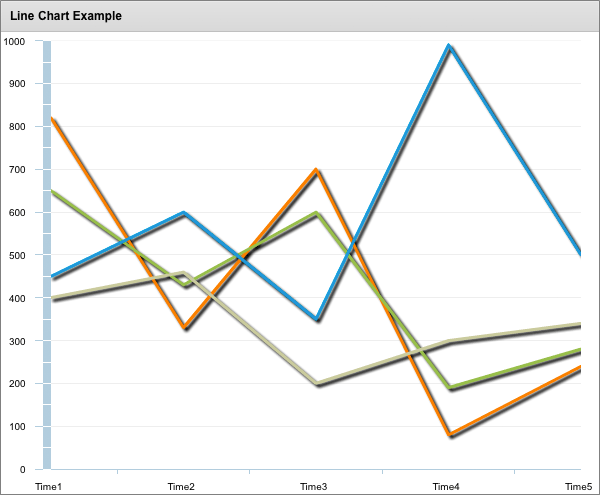
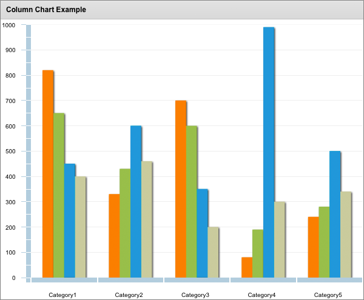
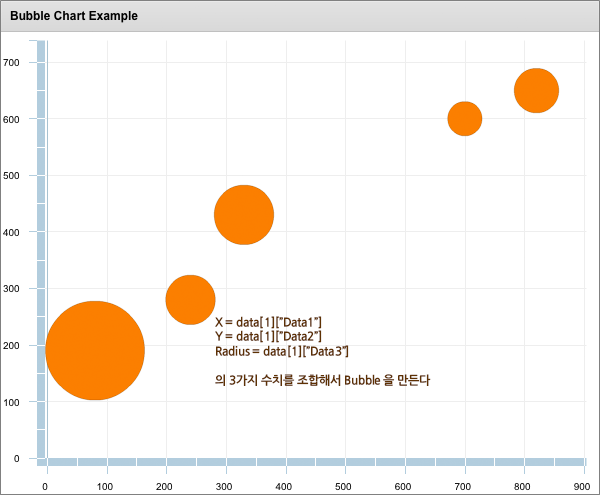
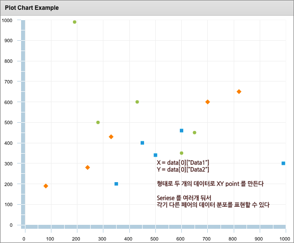
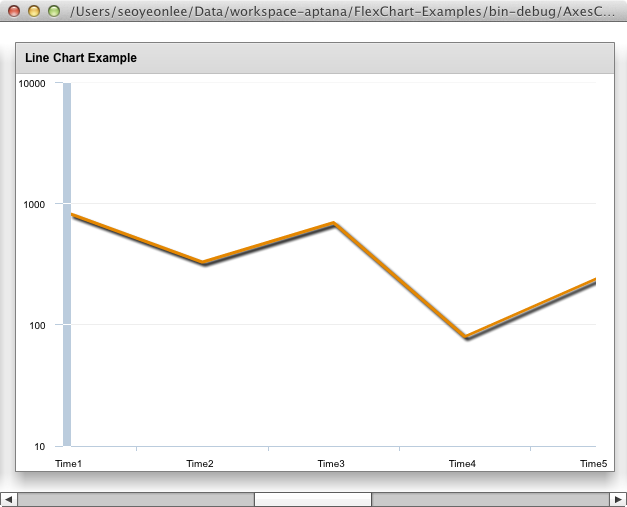
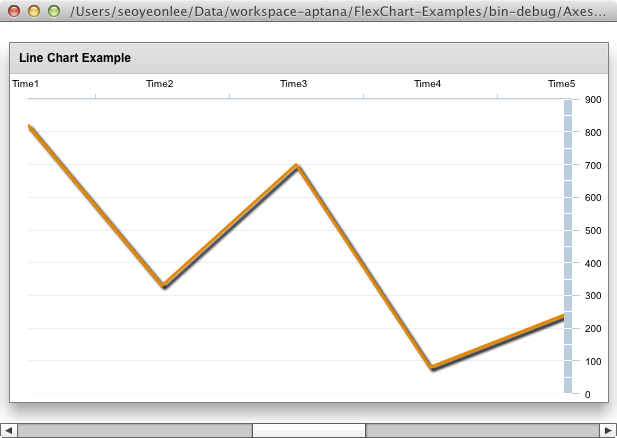
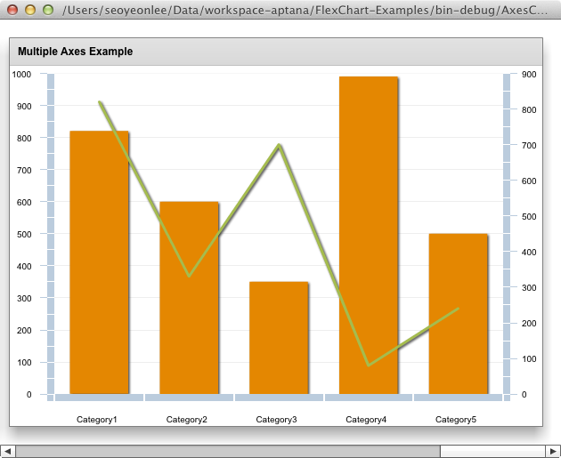

# 차트의 데이터 표현

## 차트별 표현 가능한 데이터들

	// 사용할 데이터 구조
	{Category: "Category1", Time: "Time1", Data1: 820, Data2: 650, Data3: 450, Data4: 400},
	{Category: "Category2", Time: "Time2", Data1: 330, Data2: 430, Data3: 600, Data4: 460},
	{Category: "Category3", Time: "Time3", Data1: 700, Data2: 600, Data3: 350, Data4: 200},
	{Category: "Category4", Time: "Time4", Data1: 80, Data2: 190, Data3: 990, Data4: 300},
	{Category: "Category5", Time: "Time5", Data1: 240, Data2: 280, Data3: 500, Data4: 340}

	<embed src="images/ChartAndDataTypes.swf" width="100%" height="600"/>

[swf source code](https://github.com/iamssen/SSenKit.AS3/blob/1eda5c2811b484159a0a2d1d359edd86d37a3f1c/src/ssen/displaykit/chart/Chart__Example.mxml)

### X = Label, Y = Data 형태의 차트들

- X 축은 시간의 흐름, 그룹 등의 문자열로 된 구분을 줄 수 있다
- Y 축은 데이터의 수치적 표현을 줄 수 있다

### X = Data, Y = Data 형태의 차트들

- XY 모두 데이터의 수치적 표현을 주고, XY point 에 구분을 줄 수 있다

### 기타 형태의 차트들

### 차트의 혼합

같은 유형을 가진 차트들의 경우 기본적으로 Series 를 혼합해서 사용할 수 있다.

다만, Chart Component 가 Series 에 대한 스타일 지원을 해주지 않아서 맞춰줘야 하는 경우가 있다.

## Axis

기본적으로 차트에서 자동으로 지정되지만, Candlestick 과 같이 X Axis 상에 Label Data 를 알 수 없거나 하는 경우 차트를 보강하는 형태로 사용할 수 있거나,

	<s:Panel title="Candlestick Chart Example" width="600" height="100%">
		<mx:CandlestickChart showDataTips="true" dataProvider="{data}" width="100%" height="100%">
			<mx:horizontalAxis>
				<!-- X Axis 상에 기본적으로 등장하지 않는 Label 을 등장시킬 수 있다 -->
				<mx:CategoryAxis categoryField="Category"/>
			</mx:horizontalAxis>

			<mx:series>
				<mx:CandlestickSeries openField="Data2" highField="Data1" closeField="Data4" lowField="Data3"/>
			</mx:series>
		</mx:CandlestickChart>
	</s:Panel>

숫자형 Axis 의 minimum, maximum 수치를 조절하거나 할 수 있다.

	<s:Panel title="Bubble Axis Control Example" width="600" height="100%">
		<mx:BubbleChart showDataTips="true" dataProvider="{data}" width="100%" height="100%">
			<mx:horizontalAxis>
				<mx:LinearAxis minimum="200" maximum="700"/>
			</mx:horizontalAxis>

			<mx:verticalAxis>
				<mx:LinearAxis minimum="200" maximum="700"/>
			</mx:verticalAxis>

			<mx:series>
				<mx:BubbleSeries xField="Data1" yField="Data2" radiusField="Data3"/>
			</mx:series>
		</mx:BubbleChart>
	</s:Panel>

특별히 차트의 데이터에 거스르지 않고, 부족한 데이터를 보강하는 측면에서 사용하면 좋을 듯 싶다.

	<s:Panel title="Candlestick Chart Example" width="600" height="100%">
		<mx:CandlestickChart showDataTips="true" dataProvider="{data}" width="100%" height="100%">
			<mx:horizontalAxisRenderers>
				<mx:AxisRenderer axis="{cshaxis}" canDropLabels="true"/>
			</mx:horizontalAxisRenderers>

			<mx:series>
				<mx:CandlestickSeries openField="Data2" highField="Data1" closeField="Data4" lowField="Data3">
					<mx:horizontalAxis>
						<mx:CategoryAxis id="cshaxis" categoryField="Category"/>
					</mx:horizontalAxis>
				</mx:CandlestickSeries>
			</mx:series>
		</mx:CandlestickChart>
	</s:Panel>

좀 더 커스텀이 많이 필요한 경우 Series 에 Axis 를 직접적으로 지정하고, Renderer 를 통해 컨트롤 할 수도 있지만, 정확한 사용법을 이해하고 사용하는 편이 좋을듯 싶다. (아직 정확한 사용법들을 알지 못하겠다)

	<s:Panel title="Candlestick Chart Example" width="600" height="100%">
		<mx:CandlestickChart showDataTips="true" dataProvider="{data}" width="100%" height="100%">
			<mx:horizontalAxisRenderers>
				<mx:AxisRenderer axis="{cshaxis}" canDropLabels="true"/>
			</mx:horizontalAxisRenderers>

			<mx:series>
				<mx:CandlestickSeries openField="Data2" highField="Data1" closeField="Data4" lowField="Data3">
					<mx:horizontalAxis>
						<mx:CategoryAxis id="cshaxis" categoryField="Category"/>
					</mx:horizontalAxis>
				</mx:CandlestickSeries>
			</mx:series>
		</mx:CandlestickChart>
	</s:Panel>

### Axis Classes

- `CategoryAxis` 기본 문자 분류형 Axis
	- `categoryField : String` Axis 에 등장할 Label 에 어떤 데이터를 출력할지 지정한다.
- `LinearAxis` 기본 숫자형 Axis
	- `minimum : Number` 차트에 등장할 최소 데이터를 지정. 음수 지정이 가능
	- `maximum : Number` 차트에 등장할 최대 데이터를 지정
- `LogAxis` 0, 10, 100, 1000…  과 같은 Log 형태 숫자형 Axis (약간 특수하게 사용됨)
	- <http://help.adobe.com/ko_KR/FlashPlatform/reference/actionscript/3/mx/charts/LogAxis.html>
	- `minimum : Number`
	- `maximum : Number`
- `DateTimeAxis`
	- <http://help.adobe.com/ko_KR/FlashPlatform/reference/actionscript/3/mx/charts/DateTimeAxis.html>
	- `minimum : Date`
	- `maximum : Date`
	- `parseFunction : Function(data:Object) : Date` 데이터가 Date 가 아닌 경우 Date 로 해석시켜줄 function 을 지정

LogAxis 는 아래와 같은 형태로 사용된다. 8000 을 입력해도 근사치의 Log 값으로 치환된다.

	<s:Panel title="Log Axis Example" width="600" height="100%">
		<mx:LineChart showDataTips="true" dataProvider="{data}" width="100%" height="100%">
			<mx:horizontalAxis>
				<mx:CategoryAxis categoryField="Time"/>
			</mx:horizontalAxis>
			
			<mx:verticalAxis>
				<mx:LogAxis minimum="10" maximum="8000"/>
			</mx:verticalAxis>

			<mx:series>
				<mx:LineSeries yField="Data1" form="segment" displayName="Data1" />
			</mx:series>
		</mx:LineChart>
	</s:Panel>

### Axis 정렬과 이중 Axis 지정

	<s:Panel title="Line Chart Example" width="600" height="100%">
		<mx:LineChart showDataTips="true" dataProvider="{data}" width="100%" height="100%">
			<mx:horizontalAxis>
				<mx:CategoryAxis id="linechartxaxis" categoryField="Time"/>
			</mx:horizontalAxis>

			<mx:verticalAxis>
				<mx:LinearAxis id="linechartvaxis"/>
			</mx:verticalAxis>

			<mx:horizontalAxisRenderers>
				<mx:AxisRenderer placement="top" axis="{linechartxaxis}"/>
			</mx:horizontalAxisRenderers>

			<mx:verticalAxisRenderers>
				<mx:AxisRenderer placement="right" axis="{linechartvaxis}"/>
			</mx:verticalAxisRenderers>

			<mx:series>
				<mx:LineSeries yField="Data1" form="segment" displayName="Data1"/>
			</mx:series>
		</mx:LineChart>
	</s:Panel>

Axis 의 위치를 바꿀 수 있다. 필요한 경우 사용이 가능하다.

	<s:Panel title="Multiple Axes Example" width="600" height="100%">
		<mx:ColumnChart showDataTips="true" dataProvider="{data}" width="100%" height="100%">
			<mx:horizontalAxis>
				<mx:CategoryAxis categoryField="Category"/>
			</mx:horizontalAxis>

			<mx:verticalAxisRenderers>
				<mx:AxisRenderer placement="left" axis="{lvax}"/>
				<mx:AxisRenderer placement="right" axis="{rvax}"/>
			</mx:verticalAxisRenderers>

			<mx:series>
				<mx:ColumnSeries xField="Category" yField="Data3" displayName="Data3">
					<mx:verticalAxis>
						<mx:LinearAxis id="lvax"/>
					</mx:verticalAxis>
				</mx:ColumnSeries>
				<mx:LineSeries yField="Data1" form="segment" displayName="Data1">
					<mx:verticalAxis>
						<mx:LinearAxis id="rvax"/>
					</mx:verticalAxis>
				</mx:LineSeries>
			</mx:series>
		</mx:ColumnChart>
	</s:Panel>

좌우가 다른 Axis 를 이중으로 사용할 수 있다. 좀 더 복합적인 데이터를 표현할때 사용이 가능하다.

사용시에 주의가 필요하다.

좌우 Axis 의 수치가 다르기 때문에 같은 값 (좌측에 기준하는 800 과 우측에 기준하는 800) 이 다른 지점을 가르킬 수 있지만, 서로 다른 수를 가르키는 것은 혼란을 주게 될 소지가 높다.

데이터들을 서로 수치 연동이 되는 (좌측은 실제 데이터 수치, 우측은 퍼센티지 수치) 형태로 지정하거나, 혹은 Axis 수치를 컨트롤 해서 컬럼차트에서 좀 떨어진 상단에 라인차트를 놓는다거나 (컬럼차트는 순수익, 라인차트는 총 자산) 식으로 컨트롤 해야 차트의 의미를 살릴 수 있다